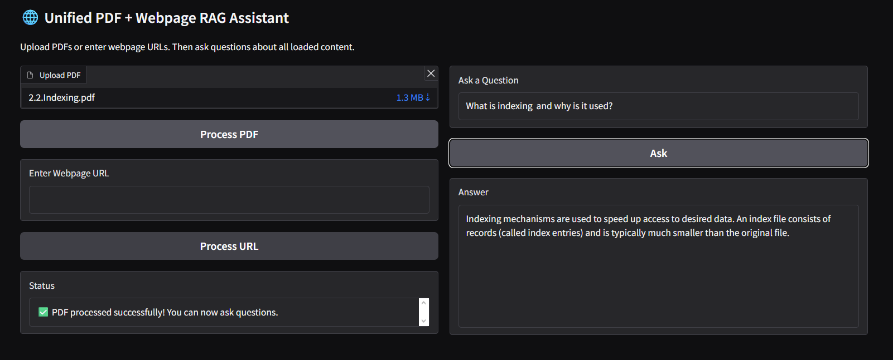
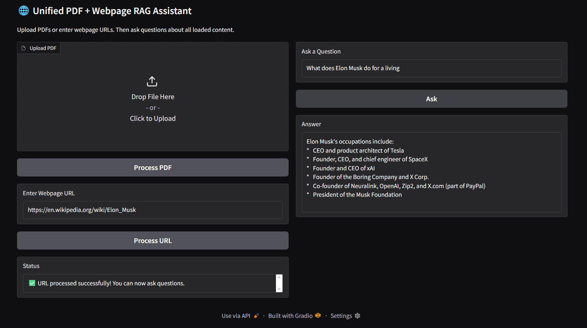

🌐 Unified PDF + Webpage RAG Assistant

A simple project that lets you upload PDFs or enter one or more URLs, extract clean text from each source, store it in a FAISS vector database, and ask questions about the content using Gemini 2.5 Flash.
This project uses LangChain, FAISS, and Gradio to build a smooth RAG workflow.

📸 Project Screenshots

🖼️ PDF Processed

🖼️ URL Processed

🚀 Features

Upload PDFs or enter one or more URLs (one per line)

Automatic extraction and cleaning of PDF text and webpage HTML

Chunking and embedding using text-embedding-004

FAISS vector store for fast similarity search

Gemini 2.5 Flash for natural and high-quality answers

Clean and modern Gradio interface

Supports multiple PDFs and URLs in the same session

🧠 How It Works

Upload PDFs or enter URLs

System extracts, cleans, and chunks the text

Chunks are embedded using Gemini embeddings

Stored in FAISS vector database

When you ask a question, the most relevant chunks are retrieved

Gemini answers using only the retrieved context

📦 Installation

Install dependencies:

pip install -r requirements.txt

Add your Google Gemini API key:

# Linux / macOS
export GEMINI_API_KEY="YOUR_KEY"

# Windows PowerShell
setx GEMINI_API_KEY "YOUR_KEY"

▶️ Run the Notebook

Open RAG-Pdf-Link-Assistant.ipynb in Jupyter or Google Colab and run the cells.

📂 Project Structure
.
├── RAG-Pdf-Link-Assistant.ipynb
├── requirements.txt
├── README.md
└── screenshots/
    ├── Rag-project-1.png
    └── Rag-project-2.png

📝 Notes

Works best on clean, text-rich PDFs and webpages

Graphical or scanned PDFs may not extract properly

Can be extended to support YouTube transcripts, DOCX files, etc.

⭐ Enjoy

If you like the project, feel free to star the repo or build on it!
